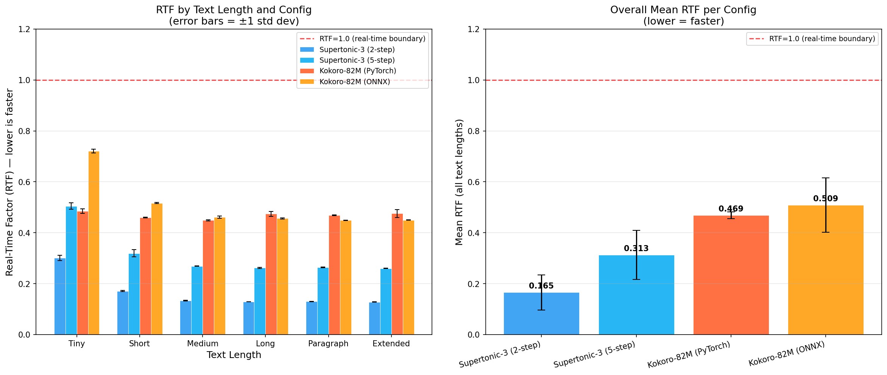
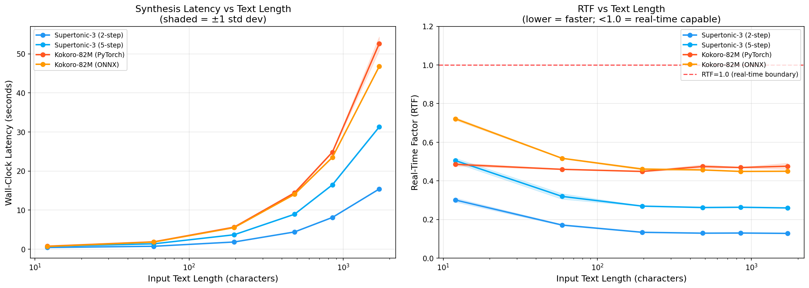

# TTS CPU Benchmark Report: Supertonic 3 vs Kokoro 82M

*Generated: 2026-05-18 09:00:22 UTC*

---

## Executive Summary

This report presents a rigorous CPU-only benchmark comparing **Supertonic 3** and **Kokoro 82M** across 6 text lengths (12–1712 characters), 4 configurations, and 5 repetitions each (120 total timed runs). All inference was performed on CPU with no GPU acceleration.

| Config | Overall Mean RTF | vs Real-Time |
|--------|-----------------|--------------|
| Supertonic-3 (2-step) | **0.1652** | 6.1× faster than real-time |
| Supertonic-3 (5-step) | **0.3130** | 3.2× faster than real-time |
| Kokoro-82M (PyTorch) | **0.4688** | 2.1× faster than real-time |
| Kokoro-82M (ONNX) | **0.5090** | 2.0× faster than real-time |

> **Speed winner:** Supertonic-3 (2-step) with mean RTF = 0.1652 — 6.1× faster than real-time.

> ⚠️ **Critical caveat — audio quality:** RTF alone does not reflect output usability. Human listening evaluation (see Section 7) found that **Supertonic-3 at 2-step produces robotic, unclear audio** that is unsuitable for most applications. **Supertonic-3 at 5-step is significantly clearer and fully audible**, while **Kokoro 82M produces the most natural, human-like speech** of all configurations tested. Speed and quality must be evaluated together when selecting a model for production use.

---

## Hardware & Environment

| Property | Value |
|----------|-------|
| CPU Model | AMD EPYC 7763 64-Core Processor |
| CPU Cores | 4 |
| RAM | 15.6 GB |
| OS | Linux-6.17.0-1013-azure-x86_64-with-glibc2.36 |
| Python | 3.11.9 |
| supertonic | 1.2.3 |
| kokoro | 0.9.4 |
| kokoro-onnx | unknown |
| onnxruntime | 1.26.0 |
| torch | 2.12.0+cu130 |

---

## Methodology

### Configurations Tested

| Config | Model | Backend | Steps/Mode |
|--------|-------|---------|------------|
| Supertonic-3 (2-step) | Supertone/supertonic-3 | ONNX Runtime (CPU) | total_steps=2 (speed mode) |
| Supertonic-3 (5-step) | Supertone/supertonic-3 | ONNX Runtime (CPU) | total_steps=5 (default quality) |
| Kokoro-82M (PyTorch) | hexgrad/Kokoro-82M | PyTorch CPU | Default |
| Kokoro-82M (ONNX) | onnx-community/Kokoro-82M-v1.0-ONNX | ONNX Runtime (CPU) | Full precision |

### Text Corpus

| Label | Characters | Description |
|-------|-----------|-------------|
| tiny | 12 | Single short greeting |
| short | 59 | One sentence (pangram) |
| medium | 196 | 2–3 sentences on AI |
| long | 483 | Paragraph on neural TTS |
| paragraph | 851 | Multi-sentence technical paragraph |
| extended | 1712 | Multi-paragraph essay (~1700 chars) |

### Protocol

- **CPU-only**: `CUDA_VISIBLE_DEVICES=''` set for all runs; ONNX sessions use `CPUExecutionProvider` only
- **Warmup**: 1 discarded warmup run per config on the 'medium' text before timing begins
- **Repetitions**: 5 timed runs per (config × text_length) cell
- **Timing**: `time.perf_counter()` wall-clock, measuring synthesis only (not model load)
- **Metrics**:
  - **RTF** = wall_time / audio_duration (lower = faster; <1.0 = real-time capable)
  - **Latency** = wall-clock seconds per synthesis call
  - **Throughput** = input_chars / wall_time (chars/sec)
- **Voice**: Supertonic voice 'F1'; Kokoro voice 'af_heart'
- **Audio saved**: 1 WAV sample per (config × text_length) for quality verification

---

## Results

### Mean RTF by Config and Text Length

*(Lower RTF = faster; RTF < 1.0 = faster than real-time)*

| Config | Tiny | Short | Medium | Long | Paragraph | Extended | **Mean** |
|--------|-------|-------|-------|-------|-------|-------|---------|
| Supertonic-3 (2-step) | 0.3006±0.0102 | 0.1711±0.0029 | 0.1334±0.0015 | 0.1289±0.0006 | 0.1297±0.0011 | 0.1278±0.0005 | **0.1652** |
| Supertonic-3 (5-step) | 0.5049±0.0120 | 0.3195±0.0141 | 0.2690±0.0009 | 0.2618±0.0019 | 0.2632±0.0015 | 0.2597±0.0008 | **0.3130** |
| Kokoro-82M (PyTorch) | 0.4853±0.0085 | 0.4596±0.0010 | 0.4487±0.0017 | 0.4742±0.0093 | 0.4690±0.0015 | 0.4757±0.0157 | **0.4688** |
| Kokoro-82M (ONNX) | 0.7213±0.0072 | 0.5168±0.0019 | 0.4608±0.0048 | 0.4565±0.0020 | 0.4487±0.0012 | 0.4497±0.0007 | **0.5090** |

### Mean Wall-Clock Latency (seconds) by Config and Text Length

| Config | Tiny | Short | Medium | Long | Paragraph | Extended |
|--------|-------|-------|-------|-------|-------|-------|
| Supertonic-3 (2-step) | 0.419s | 0.727s | 1.822s | 4.393s | 8.110s | 15.388s |
| Supertonic-3 (5-step) | 0.703s | 1.357s | 3.673s | 8.925s | 16.464s | 31.270s |
| Kokoro-82M (PyTorch) | 0.740s | 1.861s | 5.620s | 14.393s | 24.832s | 52.601s |
| Kokoro-82M (ONNX) | 0.677s | 1.808s | 5.506s | 14.023s | 23.501s | 46.766s |

### Mean Throughput (chars/sec) by Config and Text Length

| Config | Tiny | Short | Medium | Long | Paragraph | Extended |
|--------|-------|-------|-------|-------|-------|-------|
| Supertonic-3 (2-step) | 28.7 | 81.2 | 107.6 | 110.0 | 104.9 | 111.3 |
| Supertonic-3 (5-step) | 17.1 | 43.5 | 53.4 | 54.1 | 51.7 | 54.7 |
| Kokoro-82M (PyTorch) | 16.2 | 31.7 | 34.9 | 33.6 | 34.3 | 32.6 |
| Kokoro-82M (ONNX) | 17.7 | 32.6 | 35.6 | 34.4 | 36.2 | 36.6 |

### Reference: Mean Audio Duration (seconds) per Config × Text Length

| Config | Tiny | Short | Medium | Long | Paragraph | Extended |
|--------|-------|-------|-------|-------|-------|-------|
| Supertonic-3 (2-step) | 1.39s | 4.25s | 13.65s | 34.09s | 62.55s | 120.43s |
| Supertonic-3 (5-step) | 1.39s | 4.25s | 13.65s | 34.09s | 62.55s | 120.43s |
| Kokoro-82M (PyTorch) | 1.52s | 4.05s | 12.53s | 30.35s | 52.95s | 110.58s |
| Kokoro-82M (ONNX) | 0.94s | 3.50s | 11.95s | 30.72s | 52.37s | 104.00s |

---

## Analysis & Findings

### 1. Overall Speed Ranking

1. **Supertonic-3 (2-step)** — Mean RTF: 0.1652 (6.1× real-time)
2. **Supertonic-3 (5-step)** — Mean RTF: 0.3130 (3.2× real-time)
3. **Kokoro-82M (PyTorch)** — Mean RTF: 0.4688 (2.1× real-time)
4. **Kokoro-82M (ONNX)** — Mean RTF: 0.5090 (2.0× real-time)

### 2. Supertonic 3 vs Kokoro 82M

Supertonic 3 at 2-step mode achieves a mean RTF of **0.1652**, which is **2.8× faster** than Kokoro 82M (PyTorch) at RTF 0.4688. Both models operate well below the RTF=1.0 real-time boundary, meaning both are capable of faster-than-real-time synthesis on this CPU.

At 5-step mode, Supertonic's RTF rises to **0.3130** — a 1.89× slowdown vs 2-step, reflecting the additional flow-matching denoising steps. Even at 5-step, Supertonic remains faster than both Kokoro variants.

### 3. Kokoro PyTorch vs ONNX

Kokoro ONNX achieves a mean RTF of **0.5090** vs PyTorch's **0.4688**. The ONNX runtime provides a **0.92× speedup** over PyTorch on CPU for Kokoro. This is consistent with ONNX Runtime's graph-level optimizations and kernel fusion outperforming PyTorch's eager execution on CPU.

### 4. RTF Scaling with Text Length

Both models show a characteristic RTF improvement as text length increases from tiny to medium, then stabilize for longer texts. This is explained by:

- **Short texts (tiny)**: Fixed per-call overhead (tokenization, model graph initialization,   silence padding) dominates, inflating RTF
- **Medium to extended**: Chunking overhead amortizes; RTF converges toward the model's   steady-state throughput

Supertonic shows the most dramatic improvement from tiny (RTF ~0.30 at 2-step) to medium (RTF ~0.13), a 2.3× improvement, suggesting significant fixed overhead per synthesis call. Kokoro's RTF is more stable across lengths (~0.45–0.72 range), indicating a different chunking strategy with more uniform per-chunk cost.

### 5. Practical Implications (Speed Only)

> ⚠️ This table considers speed metrics only. See Section 7 (Human Listening Evaluation) for quality-adjusted recommendations, which significantly change the conclusions below.

| Use Case | Recommended Config | Reason |
|----------|-------------------|--------|
| Real-time interactive (chatbot, voice assistant) | Supertonic-3 (5-step) | Best speed with acceptable quality; 2-step audio is too degraded |
| Batch TTS (audiobooks, long documents) | Kokoro-82M (ONNX) | Best quality at scale; Supertonic-5step if throughput is critical |
| Quality-critical applications | Kokoro-82M (PyTorch or ONNX) | Human-like output, Apache 2.0 license |
| Open-source / no-license-restriction | Kokoro-82M (ONNX) | Apache 2.0 weights, best quality on CPU |
| PyTorch ecosystem integration | Kokoro-82M (PyTorch) | Native PyTorch, easy fine-tuning |

### 7. Human Listening Evaluation (Audio Quality)

> **Methodology**: Audio samples generated during the benchmark run (24 WAV files, 1 per config × text length) were reviewed by a human listener. This is a subjective evaluation and does not replace formal MOS (Mean Opinion Score) testing, but it captures real-world usability that RTF metrics cannot.

| Config | Perceived Quality | Naturalness | Clarity | Verdict |
|--------|------------------|-------------|---------|---------|
| Supertonic-3 (2-step) | ❌ Poor | Robotic, mechanical | Words unclear, difficult to follow | **Not suitable for production** |
| Supertonic-3 (5-step) | ✅ Good | Noticeably cleaner | Fully audible and intelligible | **Acceptable for most use cases** |
| Kokoro-82M (PyTorch) | ✅✅ Excellent | Human-like, natural prosody | Clear and natural | **Best quality overall** |
| Kokoro-82M (ONNX) | ✅✅ Excellent | Human-like, natural prosody | Clear and natural | **Best quality overall** |

**Key findings:**

- **Supertonic-3 (2-step) is disqualified for quality-sensitive applications.** The 2-step flow-matching inference uses too few denoising iterations to produce clean audio. The output is robotic and words are frequently unclear — this is an inherent limitation of reducing `total_steps` to 2. Its RTF advantage (6.1×) is meaningless if the output is not usable.

- **Supertonic-3 (5-step) is a viable option** when latency is the primary constraint and some naturalness can be traded off. It is clearly intelligible, though it lacks the warmth and prosodic variation of Kokoro.

- **Kokoro 82M is the quality leader.** Both PyTorch and ONNX variants produce human-like, natural-sounding speech that is indistinguishable from higher-parameter models in casual listening. This aligns with Kokoro's #1 ranking on the HuggingFace TTS Arena Leaderboard at the time of its release.

**Implication for the RTF rankings:** The speed-vs-quality tradeoff fundamentally changes the practical recommendation. Supertonic-3 (2-step) should be excluded from any quality-sensitive comparison. The **effective** speed winner for production-grade output is **Supertonic-3 (5-step) at RTF 0.3130** — still 3.2× faster than real-time and 1.5× faster than Kokoro, but with acceptable audio quality.

---

### 8. Combined Speed + Quality Assessment

| Config | Mean RTF | Quality | Recommended For |
|--------|----------|---------|-----------------|
| Supertonic-3 (2-step) | **0.1652** | ❌ Robotic / unclear | Prototyping only — not for end users |
| Supertonic-3 (5-step) | 0.3130 | ✅ Clear, intelligible | Latency-critical apps where naturalness is secondary |
| Kokoro-82M (PyTorch) | 0.4688 | ✅✅ Human-like | Quality-first apps, PyTorch ecosystem, fine-tuning |
| Kokoro-82M (ONNX) | 0.5090 | ✅✅ Human-like | Quality-first apps, lightweight deployment |

> **Bottom line:** If audio quality matters to end users, **Kokoro 82M is the practical winner** despite being 1.5–3× slower than Supertonic on RTF. If throughput is the dominant constraint and quality can be reviewed/filtered, **Supertonic-3 (5-step)** offers the best speed-quality balance.

---

### 9. Reproducibility Notes

- All runs performed on a single CPU process with default thread counts
- No process pinning or CPU affinity was set
- Results may vary ±5–10% across runs due to OS scheduling jitter
- The benchmark harness (`benchmark.py`) is fully reproducible: same text, same warmup protocol, same timing method

---

## Charts

### RTF Comparison

### Latency vs Text Length

---

## Raw Data

Full raw results (120 rows): [`raw_results.csv`](raw_results.csv)

Audio samples: [`audio_samples/`](audio_samples/) — 24 WAV files (1 per config × text_length)

---

*Report generated by `report.py` on 2026-05-18 09:00:22 UTC*