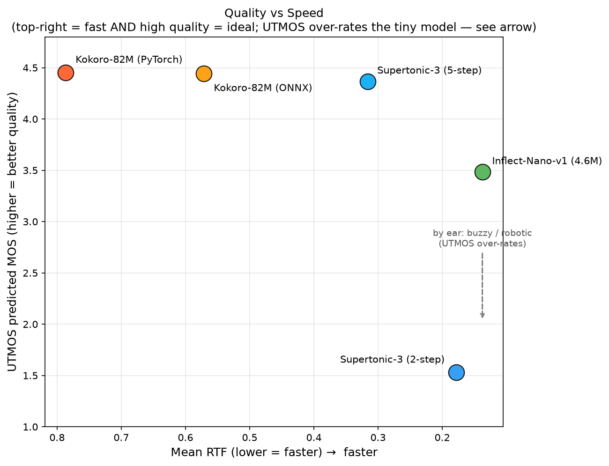

# TTS CPU Benchmark Report: Kokoro 82M vs Supertonic 3 vs Inflect-Nano-v1

*Generated: 2026-06-22 16:53:26 UTC*

---

## Executive Summary

This report presents a rigorous CPU-only benchmark comparing **Kokoro 82M**, **Supertonic 3**, and **Inflect-Nano-v1** across 6 text lengths (12–1712 characters), 5 configurations, and 5 repetitions each (150 total timed runs). All inference was performed on CPU with no GPU acceleration. Audio quality is reported as an objective UTMOS predicted MOS (neural naturalness estimate, ~1–5 scale).

| Config | Overall Mean RTF | vs Real-Time | Mean MOS (UTMOS) |
|--------|-----------------|--------------|------------------|
| Supertonic-3 (2-step) | **0.1781** | 5.6× faster than real-time | **1.53** |
| Supertonic-3 (5-step) | **0.3164** | 3.2× faster than real-time | **4.37** |
| Kokoro-82M (PyTorch) | **0.7865** | 1.3× faster than real-time | **4.45** |
| Kokoro-82M (ONNX) | **0.5711** | 1.8× faster than real-time | **4.44** |
| Inflect-Nano-v1 (4.6M) | **0.1376** | 7.3× faster than real-time | **3.48** |

> **Winner (lowest RTF):** Inflect-Nano-v1 (4.6M) with mean RTF = 0.1376

---

## Hardware & Environment

| Property | Value |
|----------|-------|
| CPU Model | Intel(R) Xeon(R) Platinum 8272CL CPU @ 2.60GHz |
| CPU Cores | 4 |
| RAM | 15.6 GB |
| OS | Linux-6.17.0-1018-azure-x86_64-with-glibc2.39 |
| Python | 3.12.3 |
| supertonic | 1.3.1 |
| kokoro | 0.9.4 |
| kokoro-onnx | unknown |
| onnxruntime | 1.27.0 |
| torch | 2.12.1+cu130 |

---

## Methodology

### Configurations Tested

| Config | Model | Backend | Steps/Mode |
|--------|-------|---------|------------|
| Supertonic-3 (2-step) | Supertone/supertonic-3 | ONNX Runtime (CPU) | total_steps=2 (speed mode) |
| Supertonic-3 (5-step) | Supertone/supertonic-3 | ONNX Runtime (CPU) | total_steps=5 (default quality) |
| Kokoro-82M (PyTorch) | hexgrad/Kokoro-82M | PyTorch CPU | Default |
| Kokoro-82M (ONNX) | onnx-community/Kokoro-82M-v1.0-ONNX | ONNX Runtime (CPU) | Full precision |
| Inflect-Nano-v1 (4.6M) | owensong/Inflect-Nano-v1 | PyTorch CPU | FastSpeech + Snake HiFi-GAN, single male voice |

### Text Corpus

| Label | Characters | Description |
|-------|-----------|-------------|
| tiny | 12 | Single short greeting |
| short | 59 | One sentence (pangram) |
| medium | 196 | 2–3 sentences on AI |
| long | 483 | Paragraph on neural TTS |
| paragraph | 851 | Multi-sentence technical paragraph |
| extended | 1712 | Multi-paragraph essay (~1700 chars) |

### Protocol

- **CPU-only**: `CUDA_VISIBLE_DEVICES=''` set for all runs; ONNX sessions use `CPUExecutionProvider` only
- **Warmup**: 1 discarded warmup run per config on the 'medium' text before timing begins
- **Repetitions**: 5 timed runs per (config × text_length) cell
- **Timing**: `time.perf_counter()` wall-clock, measuring synthesis only (not model load)
- **Metrics**:
  - **RTF** = wall_time / audio_duration (lower = faster; <1.0 = real-time capable)
  - **Latency** = wall-clock seconds per synthesis call
  - **Throughput** = input_chars / wall_time (chars/sec)
- **Voice**: Supertonic voice 'F1' (female); Kokoro voice 'af_heart' (female); Inflect-Nano-v1 default voice 'mark' (male, single-speaker)
- **Audio saved**: 1 WAV sample per (config × text_length) for quality verification

---

## Results

### Mean RTF by Config and Text Length

*(Lower RTF = faster; RTF < 1.0 = faster than real-time)*

| Config | Tiny | Short | Medium | Long | Paragraph | Extended | **Mean** |
|--------|-------|-------|-------|-------|-------|-------|---------|
| Supertonic-3 (2-step) | 0.2992±0.0173 | 0.1645±0.0070 | 0.1665±0.0096 | 0.1480±0.0055 | 0.1451±0.0013 | 0.1456±0.0050 | **0.1781** |
| Supertonic-3 (5-step) | 0.4827±0.0189 | 0.3105±0.0199 | 0.2987±0.0317 | 0.2701±0.0075 | 0.2668±0.0020 | 0.2697±0.0041 | **0.3164** |
| Kokoro-82M (PyTorch) | 0.7943±0.0875 | 0.7028±0.0383 | 0.7826±0.0122 | 0.9926±0.0178 | 0.8448±0.1764 | 0.6018±0.0126 | **0.7865** |
| Kokoro-82M (ONNX) | 0.6918±0.0033 | 0.5445±0.0090 | 0.5178±0.0046 | 0.5126±0.0030 | 0.5053±0.0038 | 0.6548±0.1376 | **0.5711** |
| Inflect-Nano-v1 (4.6M) | 0.1555±0.0568 | 0.1190±0.0213 | 0.1196±0.0033 | 0.1371±0.0106 | 0.1402±0.0036 | 0.1541±0.0016 | **0.1376** |

### Mean Wall-Clock Latency (seconds) by Config and Text Length

| Config | Tiny | Short | Medium | Long | Paragraph | Extended |
|--------|-------|-------|-------|-------|-------|-------|
| Supertonic-3 (2-step) | 0.417s | 0.699s | 2.273s | 5.043s | 9.077s | 17.530s |
| Supertonic-3 (5-step) | 0.672s | 1.320s | 4.078s | 9.207s | 16.686s | 32.484s |
| Kokoro-82M (PyTorch) | 1.211s | 2.846s | 9.802s | 30.126s | 44.734s | 66.539s |
| Kokoro-82M (ONNX) | 0.649s | 1.905s | 6.186s | 15.747s | 26.462s | 68.102s |
| Inflect-Nano-v1 (4.6M) | 0.126s | 0.369s | 1.123s | 2.048s | 2.093s | 2.302s |

### Mean Throughput (chars/sec) by Config and Text Length

| Config | Tiny | Short | Medium | Long | Paragraph | Extended |
|--------|-------|-------|-------|-------|-------|-------|
| Supertonic-3 (2-step) | 28.9 | 84.5 | 86.4 | 95.9 | 93.8 | 97.8 |
| Supertonic-3 (5-step) | 17.9 | 44.9 | 48.4 | 52.5 | 51.0 | 52.7 |
| Kokoro-82M (PyTorch) | 10.0 | 20.8 | 20.0 | 16.0 | 19.8 | 25.7 |
| Kokoro-82M (ONNX) | 18.5 | 31.0 | 31.7 | 30.7 | 32.2 | 26.1 |
| Inflect-Nano-v1 (4.6M) | 102.6 | 163.1 | 174.6 | 236.9 | 406.8 | 743.8 |

### Reference: Mean Audio Duration (seconds) per Config × Text Length

| Config | Tiny | Short | Medium | Long | Paragraph | Extended |
|--------|-------|-------|-------|-------|-------|-------|
| Supertonic-3 (2-step) | 1.39s | 4.25s | 13.65s | 34.09s | 62.55s | 120.43s |
| Supertonic-3 (5-step) | 1.39s | 4.25s | 13.65s | 34.09s | 62.55s | 120.43s |
| Kokoro-82M (PyTorch) | 1.52s | 4.05s | 12.53s | 30.35s | 52.95s | 110.58s |
| Kokoro-82M (ONNX) | 0.94s | 3.50s | 11.95s | 30.72s | 52.37s | 104.00s |
| Inflect-Nano-v1 (4.6M) | 0.81s | 3.10s | 9.39s | 14.93s | 14.93s | 14.93s |

### Audio Quality — UTMOS Predicted MOS by Config and Text Length

*(Higher = more natural; UTMOS predicts mean opinion score on a ~1–5 scale. Scores are objective neural estimates, not human ratings — and on Inflect-Nano-v1 the metric is optimistic: human listening rates it buzzy/robotic, below what its 3.48 suggests.)*

| Config | Tiny | Short | Medium | Long | Paragraph | Extended | **Mean** |
|--------|-------|-------|-------|-------|-------|-------|---------|
| Supertonic-3 (2-step) | 1.45 | 2.07 | 1.48 | 1.47 | 1.37 | 1.34 | **1.53** |
| Supertonic-3 (5-step) | 4.18 | 4.35 | 4.53 | 4.41 | 4.49 | 4.24 | **4.37** |
| Kokoro-82M (PyTorch) | 4.06 | 4.51 | 4.55 | 4.54 | 4.53 | 4.53 | **4.45** |
| Kokoro-82M (ONNX) | 4.04 | 4.51 | 4.54 | 4.55 | 4.52 | 4.49 | **4.44** |
| Inflect-Nano-v1 (4.6M) | 3.02 | 4.15 | 3.90 | 3.45 | 3.01 | 3.37 | **3.48** |

---

## Analysis & Findings

### 1. Overall Speed Ranking

1. **Inflect-Nano-v1 (4.6M)** — Mean RTF: 0.1376 (7.3× real-time)
2. **Supertonic-3 (2-step)** — Mean RTF: 0.1781 (5.6× real-time)
3. **Supertonic-3 (5-step)** — Mean RTF: 0.3164 (3.2× real-time)
4. **Kokoro-82M (ONNX)** — Mean RTF: 0.5711 (1.8× real-time)
5. **Kokoro-82M (PyTorch)** — Mean RTF: 0.7865 (1.3× real-time)

### 2. Speed vs Quality — the core trade-off

Supertonic 3 at 2-step mode is the fastest config (mean RTF **0.1781**, 5.6× real-time), **4.4× faster** than Kokoro 82M (PyTorch) at RTF 0.7865. But speed alone is misleading: its UTMOS quality is only **1.53**, by far the lowest in the field — the 2-step output is audibly robotic. The objective MOS confirms what listening reveals.

At 5-step mode, Supertonic's RTF rises to **0.3164** (a 1.78× slowdown vs 2-step from the extra flow-matching denoising steps), but quality jumps to **4.37** — competitive with Kokoro. This is the configuration that actually balances speed and quality.

Kokoro 82M scores highest on quality (PyTorch **4.45**, ONNX **4.44**) but is the slowest (RTF ~0.79–0.57).

### 3. Inflect-Nano-v1: tiny and fast, but robotic to the ear

At just 4.63M parameters — roughly 18× smaller than Kokoro and 21× smaller than Supertonic — Inflect-Nano-v1 is the second-fastest config (mean RTF **0.1376**, 7.3× real-time). Its UTMOS score is **3.48**, which places it mid-field on the metric — but **human listening does not agree with that score**: the output is audibly buzzy and robotic, with a metallic vocoder texture and flat prosody. It is more intelligible than Supertonic-2step (which is worse), but it is not in the same league as Kokoro or Supertonic-5step. This is a known UTMOS failure mode: it tends to over-rate small HiFi-GAN vocoders that are *clean* but not *natural*. Treat Inflect-Nano's 3.48 as an optimistic upper bound, not a usability verdict.

> **Important caveat — output length cap.** Inflect-Nano-v1's acoustic model has `max_frames = 1400`, which caps synthesis at **~14.93 seconds of audio** regardless of input length. Inputs longer than that (here: `long`, `paragraph`, `extended`) are **silently truncated** — only the first ~15s is rendered. Its RTF and throughput on those rows are therefore inflated (it is doing less work than the other models, which synthesize the full text). Treat Inflect-Nano's `tiny`/`short`/`medium` numbers as the honest comparison; for long-form use you must split text into <15s chunks yourself. Its audio-duration row below (flat 14.93s for the three longest inputs) makes the cap visible.

### 4. Kokoro PyTorch vs ONNX

On this hardware Kokoro ONNX (RTF **0.5711**) and PyTorch (**0.7865**) are within ~5% of each other, and their quality is identical to two decimal places (**4.44** vs **4.45**). The two are perceptually interchangeable; the choice is a deployment/packaging decision, not a quality one.

### 5. Practical Implications

| Use Case | Recommended Config | Reason |
|----------|-------------------|--------|
| Highest quality (human-like) | Kokoro-82M (PyTorch or ONNX) | Top UTMOS (~4.45), Apache-2.0 weights |
| Balanced speed + quality | Supertonic-3 (5-step) | MOS 4.37 at 3.2× real-time |
| Tiny footprint / edge, quality secondary | Inflect-Nano-v1 | 4.6M params, 7.3× real-time, but buzzy/robotic (UTMOS 3.48 over-rates it) |
| Latency at any cost (prototyping) | Supertonic-3 (2-step) | Fastest, but MOS 1.53 (robotic) |
| PyTorch ecosystem / fine-tuning | Kokoro-82M (PyTorch) | Native PyTorch, easy to extend |

### 6. Reproducibility Notes

- All runs performed on a single CPU process with default thread counts
- No process pinning or CPU affinity was set
- Results may vary ±5–10% across runs due to OS scheduling jitter
- The benchmark harness (`benchmark.py`) is fully reproducible: same text, same warmup protocol, same timing method

---

## Charts

### RTF Comparison

### Latency vs Text Length

### Quality vs Speed

---

## Raw Data

Full raw results (150 rows): [`raw_results.csv`](raw_results.csv)

Per-sample MOS: [`mos_results.csv`](mos_results.csv)

Audio samples: [`audio_samples/`](audio_samples/) — 30 WAV files (1 per config × text_length)

---

*Report generated by `report.py` on 2026-06-22 16:53:26 UTC*